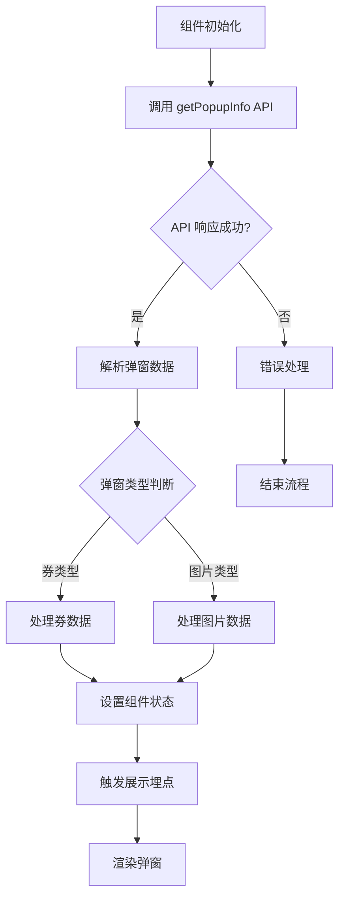

```mermaid
graph TD
    A[组件初始化] --> B[调用 getPopupInfo API]
    B --> C{API 响应成功?}
    C -->|是| D[解析弹窗数据]
    C -->|否| E[错误处理]
    D --> F{弹窗类型判断}
    F -->|券类型| G[处理券数据]
    F -->|图片类型| H[处理图片数据]
    G --> I[设置组件状态]
    H --> I
    I --> J[触发展示埋点]
    E --> K[结束流程]
    J --> L[渲染弹窗]
```